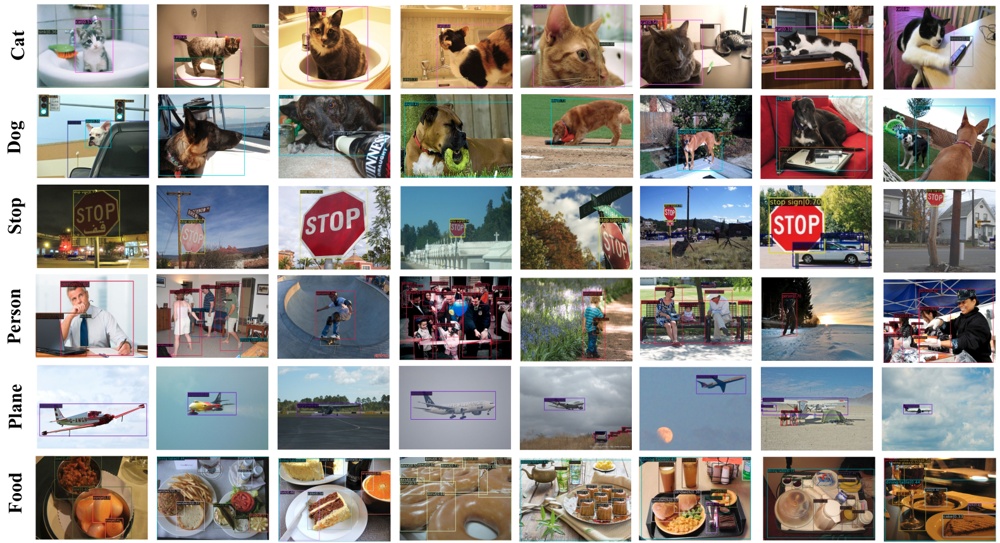

<div align='center'>

# <p><strong><em>PHOENIX:</em></strong></p> Photonic Distillation Transfers Electronic Knowledge to Hybrid Optical Neural Networks
Authors
</div>

## Introduction

💥PHOENIX presented the first optoelectrically fused neural network deployment framework for object detection tasks, demonstrating its performance in industrial-level large datasets (e.g., COCO) and benchmark models. 
Compared to state-of-the-art electronic models, our solution achieved approximately 85.0% accuracy. The accuracy was further improved to 93.0% through our novel knowledge distillation strategy. 
Furthermore, we achieved 86.5% energy reduction and 11.3× speed acceleration compared to equivalent edge GPUs by successfully transferring spatial attention knowledge from the electronic domain to the photonic domain, 
making it an ideal choice for real-time, energy-critical industrial applications. This technique not only bridges the performance gap but also offers an alternative physically interpretable platform for AI. Our universal framework paves the way for extending ONN deployment to a wider range of deep learning models and applications, whether based on CNN or Transformer architectures, providing a compelling choice for real-time, energy-critical scenarios such as autonomous driving, smart surveillance, and industrial automation.💥
<p align="center">
  
</p>

## Overview
💥 Overview of the proposed hybrid photoelectronic object detection framework, ***PHOENIX***.
The system is built upon a state-of-the-art baseline detector, where early-stage extracts low/mid-level
features by the CNN-based or Transformer-based method. The key component of the knowledge
distillation module transfers all-electronic ’teacher’ backbone to the ONN ’student’ stages, enhancing
their functional capabilities. Finally, features output by the ONN-processed segment of the backbone
are fed to a task-specific detection head for object classification and localization.

<p align="center">
  
</p> 

## Details architecture of ONN and Distillation module.

<div style="display: flex; justify-content: space-between;">
    
    
</div>

## Qualitative Rendered Visualization
### ONN experimental architecture and the Distribution of the Diffracted Field simulated in FDTD.
<p align="center">
  
</p> 

### Detection performance on MS-COCO dataset
<p align="center">
  
</p> 

### Detection performance on nuScenes dataset
<p align="center">
  
</p> 

## Main Results
### Object Detection Performance on MS-COCO dataset

### Object Detection Performance on MS-COCO on nuScenes dataset

### Ablation studies.
<div style="display: flex; justify-content: space-between;">
    
    

</div>
<div style="display: flex; justify-content: space-between;">
    
    
</div>

More comprehensive ablation studies can be found at APPENDIX SECTION. 

## Getting Started
## Installation
This project is based on MMDetection3D, which can be constructed as follows.

- Install PyTorch [v1.13.1](https://pytorch.org/get-started/previous-versions/) and mmDetection3D [1.0.0rc6](https://github.com/open-mmlab/mmdetection3d/tree/v1.0.0rc6) following the [instructions](https://github.com/open-mmlab/mmdetection3d/blob/v1.0.0rc6/docs/en/getting_started.md).
- Install the required environment

```
conda create -n phoenix python=3.8
conda activate phoenix
pip install torch==1.13.1+cu117 torchvision==0.14.1+cu117 torchaudio==0.13.1 --extra-index-url https://download.pytorch.org/whl/cu117

pip install mmcv-full==1.7.1 -f https://download.openmmlab.com/mmcv/dist/cu117/torch1.13/index.html
pip install mmdet3d==1.0.0rc6 mmdet==2.28.2 mmsegmentation==0.30.0 
```
### Data Preparation
Please download the MS-COCO and nuScenes dataset from the official website.

### Training & Testing
You can train and eval the model following the instructions. For example:
```
# Training
bash tools/dist_train.sh 1 8 $config

# test
bash tools/dist_test.sh 8 $config $ckpt
```
### Weights
#### 1. Object Detection
| Method             |  Config        | mAP  | Relative SOTA |  Model |
|--------------------|-------------------------------------------------------------------------|------|---------------|--------
| **1xONN-nuScenes** | [**1xONN**](projects/configs/exp/fcos_regnet_1onn_3cnn_nusc.py) | 19.8 | 97.5%           | [Google](https://drive.google.com/drive/folders/1Sr0M80EeB5Qmbk7fWuTIJgeKljo5U0Iz)
| **1xONN-COCO**     | [**1xONN**](projects/configs/exp/fcos_regnet_1onn_3cnn_coco.py) | 26.3 | 88.3%         | [Google](https://drive.google.com/drive/folders/1Sr0M80EeB5Qmbk7fWuTIJgeKljo5U0Iz)


## News

- [2025-05-29] 🚀 The codebase is initialed and the inference code and associated weights have been released. We are diligently preparing for a clean, optimized version. Stay tuned for the complete code release, which is coming soon..

## TODO
* Release training code.